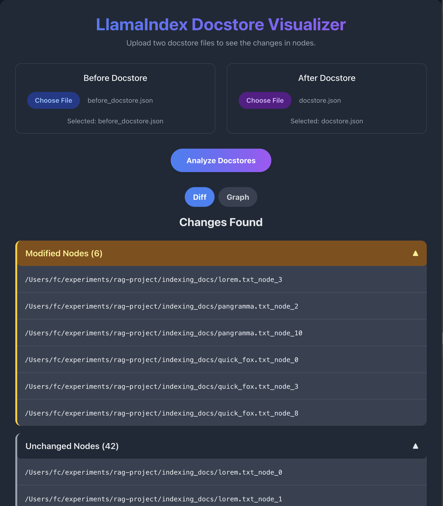
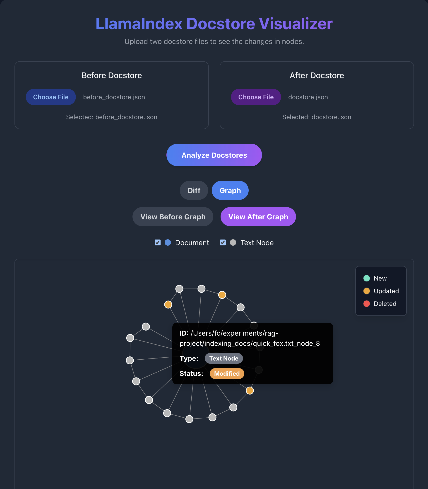

# LlamaIndex Docstore Visualizer

<p align="center">
  
  
</p>

## 🚀 Purpose

**LlamaIndex Docstore Visualizer** is a powerful, interactive tool for exploring and comparing LlamaIndex docstore JSON files.  
It helps you **see the structure, relationships, and changes** between two versions of your docstore, making debugging and understanding your data easy and visual.

## ✨ Features

- **Upload & Compare:**  
  Upload two docstore JSON files ("Before" and "After") and instantly see the differences.

- **Diff Accordion:**  
  Changes are grouped by type (Added, Deleted, Modified, Unchanged) in a clear, collapsible accordion.

- **Interactive Graph:**  
  Visualize the document and text node relationships as a zoomable, draggable graph.  
  Node types and statuses are color-coded, and you can filter which node types are shown.

- **Rich Tooltips:**  
  Hover over nodes to see detailed info, with type and status shown in stylish pill badges.

## 🛠️ How to Use

1. **Clone this repo and install dependencies:**
   ```bash
   git clone https://github.com/FrancescoCrecchi/LlamaIndex-Docstore-Visualizer.git
   cd docstore-visualizer
   npm install
   ```

2. **Start the app:**
   ```bash
   npm run dev
   ```

3. **Open in your browser:**  
   Visit [http://localhost:5173](http://localhost:5173) (or the port shown in your terminal).

4. **Upload your docstore files:**  
   - Click "Before Docstore" and "After Docstore" to select your JSON files.
   - Click "Analyze Docstores" to see the changes and graph.

## 💡 Why Use This Tool?

- **Instant insight** into your docstore changes.
- **Visual debugging** for LlamaIndex projects.
- **Shareable screenshots** for documentation or team discussions.

---

**Made with ❤️ for the LlamaIndex community**
